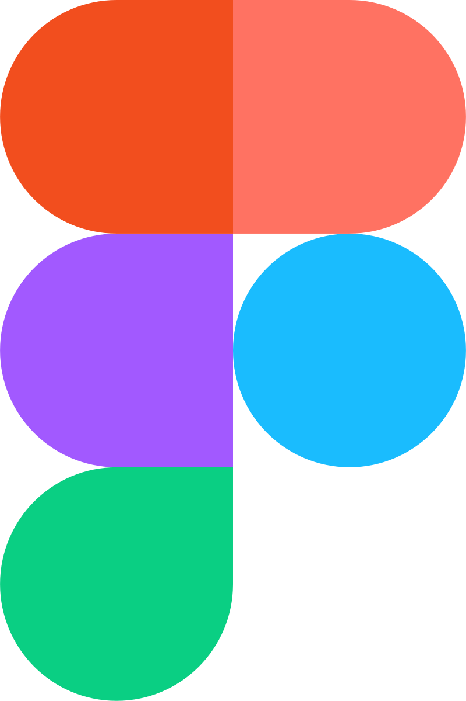

<h1 align="center"><em>2048</em></h1>

  

    
🧠 Logical thinking

    
🕠Play in your free time

    
🆠Try to make 2048

# 📋 Description
### We are team DivisionX. We will present our version of the popular "2048" game. The idea of the game is to make 2048 and improve your logical thinking while having fun playing.

# 💻 Languages-Frameworks-Tools

## Languages
 

 

## Design
 

    
    

## Code editors & collaborative services
 

 
  

## Documents
 

# 📁 Documents
### Documentation

### Presentation

### Design

# 👥 Team

| Name | Role | Grade |
| :---:   | :---: | :---: |
|  <h3><a href = "https://github.com/BZIleva23">Beloslava Ileva</a></h3> | Scum - trainer | 9G |
| <h3><a href = "https://github.com/GSBadalova23">Gabriela Badalova</a></h3> | Front-End Developer | 9B |
| <h3><a href = "https://github.com/KRKolev23">Kaloyan Kolev</a></h3> |  Back-End Developer  | 9A |
|  <h3><a href = "https://github.com/EDMancheva23">Emanuela Mancheva</a></h3> | Deesigner | 9A |
| <h3><a href = "https://github.com/IYDineva23">Irina Dimova</a></h3> |  | 9A |

